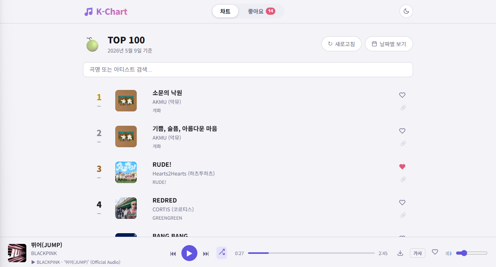

# 🎵 mel-tube



멜론 TOP 100 실시간 차트를 보고, 벅스 검색으로 곡을 찾고, 유튜브 오디오로 바로 재생하는 로컬 웹앱입니다.

## 기능

- **실시간 차트** — 멜론 TOP 100 크롤링 (5분 캐시)
- **벅스 검색** — 벅스 뮤직 곡 검색 (앨범아트 포함)
- **유튜브 재생** — 곡 클릭 시 유튜브에서 오디오만 스트리밍
- **재생 모드** — 1곡 반복 / 전체 재생 / 전체 랜덤 토글
- **좋아요** — 좋아요한 곡 모아보기, 전체 재생
- **가사** — 멜론 가사 슬라이드업 패널 (벅스 검색 곡도 멜론에서 가사 자동 매칭)
- **MP3 다운로드** — 앨범아트 + 가사(USLT 프레임) + 태그 포함
- **날짜별 히스토리** — 차트 스냅샷을 Cloudflare R2에 날짜별 저장
- **백그라운드 YT 매칭** — 차트 로드 시 100곡 자동 유튜브 매칭 (5곡 병렬)
- **R2 캐시 프리로드** — 서버 시작 시 오늘 매칭 데이터 자동 로드로 재생 속도 향상
- **다크 / 라이트 모드** — 설정 기억
- **볼륨 기억** — 새로고침해도 유지

## 기술 스택

| 역할 | 사용 기술 |
|------|-----------|
| 차트 데이터 | 멜론 HTML 크롤링 (cheerio) |
| 검색 | 벅스 뮤직 HTML 크롤링 (cheerio) |
| 오디오 검색/추출 | yt-dlp |
| 오디오 스트리밍 | Node.js → 브라우저 프록시 |
| MP3 변환 | ffmpeg + node-id3 (앨범아트 · USLT 가사 태그) |
| 히스토리 저장 | Cloudflare R2 (S3 호환) |
| 프론트엔드 | 바닐라 HTML / CSS / JS |
| 백엔드 | Node.js + Express |

## 시작하기

### 요구사항

- Node.js 18+
- ffmpeg — [gyan.dev](https://www.gyan.dev/ffmpeg/builds/) 또는 `winget install Gyan.FFmpeg`
- (선택) Cloudflare R2 계정 — 없으면 히스토리 저장 기능만 비활성화

### 설치

```bash
git clone https://github.com/JKH-ML/mel-tube.git
cd mel-tube
npm install
```

### 환경변수 설정

```bash
cp .env.example .env
```

`.env` 파일을 열고 본인 R2 정보 입력:

```env
R2_ACCOUNT_ID=your_cloudflare_account_id
R2_ACCESS_KEY_ID=your_r2_access_key_id
R2_SECRET_ACCESS_KEY=your_r2_secret_access_key
R2_BUCKET=kpop-chart
R2_ENDPOINT=https://your_account_id.r2.cloudflarestorage.com
```

> R2 없이 실행해도 차트 조회, 재생, 다운로드는 정상 동작합니다. 히스토리 저장만 스킵됩니다.

### R2 세팅 방법

1. [dash.cloudflare.com](https://dash.cloudflare.com) → **R2 Object Storage** → **Create bucket**
2. 버킷 이름 입력 (예: `kpop-chart`)
3. R2 메인 페이지 우상단 → **Manage R2 API tokens** → **Create API token**
4. 권한: **Object Read & Write**, 대상 버킷 선택
5. 발급된 **Account ID / Access Key ID / Secret Access Key** 를 `.env`에 입력

### 실행

```bash
npm start
```

브라우저에서 http://localhost:3000 접속

> 첫 실행 시 `yt-dlp.exe`를 자동으로 다운로드합니다 (약 30초 소요).

### 바탕화면 바로가기 만들기

바로가기를 만들면 서버 시작과 동시에 브라우저가 자동으로 열립니다.

1. 바탕화면에서 **우클릭 → 새로 만들기 → 바로 가기**
2. 대상 항목에 아래 입력:
   ```
   cmd.exe /k "cd /d C:\study\mel-tube && start http://localhost:3000 && npm start"
   ```
3. (선택) 바로가기 우클릭 → **속성** → **아이콘 변경**으로 아이콘 커스텀

종료는 터미널 창을 닫거나 `Ctrl+C`로 합니다.

## API

| 메서드 | 경로 | 설명 |
|--------|------|------|
| GET | `/api/chart` | 멜론 TOP 100 차트 |
| GET | `/api/bugs-search?q=` | 벅스 뮤직 곡 검색 |
| GET | `/api/info?title=&artist=` | 유튜브 영상 메타 정보 |
| GET | `/api/stream?title=&artist=` | 오디오 스트리밍 프록시 |
| GET | `/api/download?title=&artist=&songId=` | MP3 다운로드 — 멜론 곡 (앨범아트 · 가사 포함) |
| GET | `/api/download?title=&artist=&cover=` | MP3 다운로드 — 벅스 곡 (앨범아트 · 가사 포함) |
| GET | `/api/lyrics?songId=` | 멜론 가사 |
| GET | `/api/bugs-lyrics?title=&artist=` | 벅스 곡 가사 (멜론 검색으로 자동 매칭) |
| GET | `/api/match-status` | 백그라운드 매칭 큐 상태 |
| GET | `/api/history` | 저장된 날짜 목록 |
| GET | `/api/history/:date` | 특정 날짜 차트 스냅샷 |

## R2 저장 구조

```
kpop-chart
├── charts/
│   ├── 2026-05-09/
│   │   └── melon.json      # 100곡 전체 스냅샷
│   └── 2026-05-10/
│       └── melon.json
└── yt-matches/
    ├── 2026-05-09.json     # 그날 매칭된 유튜브 정보
    └── 2026-05-10.json
```

## 주의사항

- 멜론 크롤링은 개인 학습 목적으로만 사용하세요
- yt-dlp를 통한 유튜브 오디오 스트리밍은 개인 감상 목적으로만 사용하세요
- `.env` 파일을 절대 공유하거나 git에 커밋하지 마세요 (`.gitignore`에 포함되어 있음)
